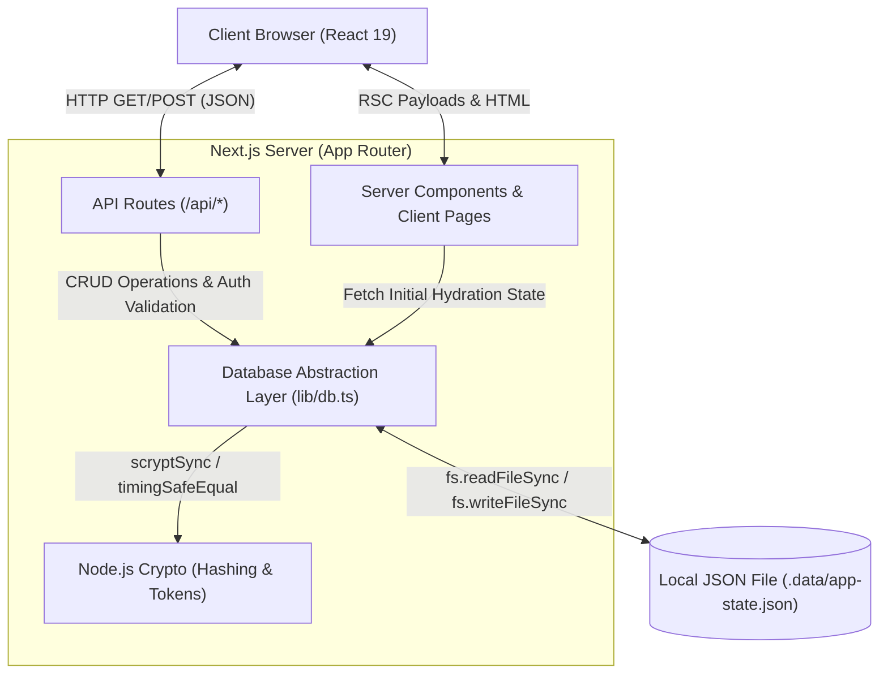

# Introvert Connect (TaskBoard OS)

A multi-page Next.js web application tailored for a low-pressure social and productivity experience. It perfectly balances a focused task management system (Kanban style) with an introvert-friendly campus networking platform. Features include profile matching based on shared interests, quiet messaging, friend requests, and a beautifully designed, premium dark-themed interface built from scratch using pure CSS glassmorphism.

## 🚀 Tech Stack

- **Framework:** [Next.js](https://nextjs.org/) (App Router, v16.1.6)
- **UI Library:** [React](https://react.dev/) (v19.2.3)
- **Language:** TypeScript (Strict Mode)
- **Styling:** Custom Vanilla CSS utilizing advanced CSS variables, deep-space mesh gradients, and sophisticated glassmorphic surfaces (`backdrop-filter`).
- **Typography:** Custom imported Google Font via `next/font/google` (Inter).
- **Database/Persistence:** Local JSON file storage (`.data/app-state.json`) natively engineered using the Node.js `fs` (File System) and `path` modules.
- **Authentication:** Custom, built-in session-based authentication utilizing Node.js's native `crypto` module (specifically `scrypt` for robust password hashing and timing-safe comparisons).

---

## 🛠 Architecture & Data Workflow

The application operates as a monolithic Next.js architecture, leveraging the modern App Router (`app/` directory). The frontend consists of server-rendered and client-rendered React components that communicate with Next.js API Routes.

Instead of an external database, this project uses a unified **Database Abstraction Layer** (`lib/db.ts`). This layer acts as a pseudo-database driver that reads, parses, mutates, and writes back to a local JSON file (`.data/app-state.json`) synchronously. 



---

## ✨ Detailed Feature Breakdown

### 1. Pseudo-Database & File-Based Persistence
To eliminate the overhead of maintaining an external PostgreSQL or MongoDB instance during development and testing, the application utilizes a clever local JSON persistence strategy. 
- **Initialization Strategy:** On startup (or upon the first API hit), `lib/db.ts` checks for the existence of `.data/app-state.json`. If it doesn't exist, it seeds the application with mock data (users, tasks, messages, etc.) from `lib/seed.ts`.
- **Synchronous Writes:** Every mutation—whether creating a task, updating a profile, or sending a message—pulls the JSON file into memory, strictly types it against `DatabaseShape`, updates the relevant arrays, and synchronously flushes it back to the disk.

### 2. Custom Security & Authentication
The platform implements a highly secure, custom authentication flow without relying on third-party providers like NextAuth or Clerk.
- **Registration Constraints:** Enforces institutional access by only allowing `@srmist.edu.in` email addresses.
- **Password Hashing:** Passwords are never stored in plaintext. They are mathematically hashed using a cryptographically secure random salt and Node.js `scryptSync`, stored in a `salt:hash` format. Verification is protected against timing attacks using `timingSafeEqual`.
- **Session Management:** Upon successful login, a random 24-byte hex token is generated and stored in a stateful `sessions` array. This token validates all subsequent API requests.

### 3. Task Management Engine (Dashboard)
The core productivity tool functions like a digital Kanban board, designed for clarity.
- **Task Hierarchy:** Tasks consist of titles, assignees, sprints, priorities (`must`, `should`, `week`), and an array of granular subtasks.
- **Smart Status Syncing:** Toggling a subtask automatically triggers the `syncTaskStatus` utility. If all subtasks are checked, the parent task is instantly marked as `completed`. If partially complete, it shifts to `in-progress`.
- **Buckets:** Tasks are visually grouped into "Buckets" which can be collapsed/expanded to reduce cognitive overload.

### 4. Quiet Networking (Matching & Friend Requests)
Designed specifically for introverts, the social features are low-pressure and asynchronous.
- **Interest-Based Matching:** Users can browse curated profiles (simulated matches), view overlapping interests via pill-tags, and "Save" matches for later without sending an immediate notification.
- **Friend Requests:** A dedicated workflow for sending connections. Requests sit in a `pending` state until the recipient chooses to `accept` or `reject` them.
- **Real-time Notifications:** All social interactions (messages received, friend requests updated, matches saved) programmatically inject alerts into the user's `notifications` array.

### 5. Premium Deep Space Glassmorphism (UI)
The aesthetic is deliberately designed to feel like a high-end, premium "OS" rather than a standard webpage.
- **Dynamic Mesh Gradients:** The `body` background utilizes a complex, 3-point animated CSS radial gradient combining deep purples, cyans, and pinks over a dark `#0a0a0e` canvas.
- **Glassmorphic Depth:** Every card, sidebar, and panel utilizes `backdrop-filter: blur(16px)` and semi-transparent RGBA backgrounds. Inner box-shadow glows simulate the light refraction of frosted glass.
- **Micro-Animations:** Interactive elements (buttons, task cards, nav links) feature hardware-accelerated transitions (`transform: translateY(-4px)`), smooth outer glow expansions on hover, and custom-styled webkit scrollbars.

---

## 📂 Project Structure

```text
task-board-next/
├── app/
│   ├── api/            # Next.js API Routes (Auth, Tasks, Profile, Matches)
│   ├── dashboard/      # Task management page
│   ├── matching/       # Social matching algorithms & UI
│   ├── profile/        # User profile settings
│   ├── globals.css     # Core Design System & Glassmorphic variables
│   └── layout.tsx      # Root layout injecting fonts and contexts
├── components/         # Reusable React UI Components (Cards, Sidebars)
├── lib/
│   ├── auth.ts         # Authentication utility wrappers
│   ├── db.ts           # Core File-System JSON Database Engine
│   ├── seed.ts         # Initial mock data for hydration
│   └── types.ts        # Global TypeScript interfaces
└── .data/              # (Auto-generated) Contains app-state.json
```

---

## 💻 Running Locally

1. **Clone the repository:**
   ```bash
   git clone <your-repo-url>
   cd task-board-next
   ```

2. **Install dependencies:**
   ```bash
   npm install
   ```

3. **Start the development server:**
   ```bash
   npm run dev
   ```

4. **Initialize Data:**
   Open [http://localhost:3000](http://localhost:3000) in your browser. The application will automatically construct the `.data/app-state.json` file and seed it with dummy data upon your first visit. You can then register a new `@srmist.edu.in` account and explore!
